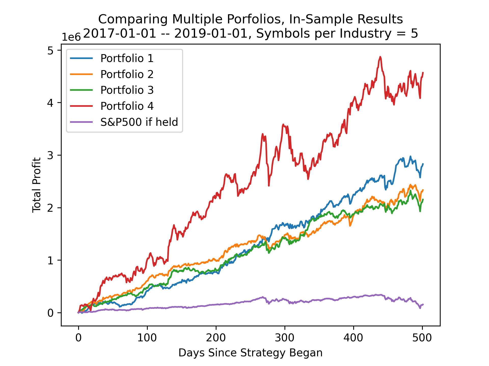

# spy-tangency-portfolio
Randomized portfolio builder I made over the summer of 2020.

The key takeaway from this project is that building a portfolio via mean-variance analysis can create a successful portfolio, even if you don't know anything in-depth about the sector/company you're investing in.

There are graphs at the bottom of the page which can help recap and visualize these findings. 

## Inspiration for this strategy
In the beginning of the summer I took a class at UChicago called 'Quantitative Portfolio Management and Algorithmic Trading'. In the beginning of the class we learned about the importance of diversification — not just as a general concept, but as tool we could take advantage of. If you have two stocks, one which is considered a good investment (say has a high sharpe ratio) and the other which is considered a bad investment, you can create a portfolio which performs better on a backtest than either of those portfolios can by themselves. By creating a tangency portfolio that weighs each stock based on their performance, you can allocate certain percentages of your total investment (such as 80/20, or -20/120 if you want to short a stock) that takes advantage of the fact that stocks move together/against each other in a predictable manner. Furthermore, if you want to get a certain mean return out of this portfolio with the least amount of volatility possible, you can do so by conducting a mean-variance analysis which will change the weights of each stock to match the target mean return while reducing the variance of the portfolio as much as possible.

I also learned in the beginning of this class about the investment strategy used by Harvard in the case study "The Harvard Management Company and Inflation-Protect Bonds", written by Luis M. Viceira. In this paper I learned that in 2000, Harvard analyzed how they invested their endowment by using a mean-variance analysis. This is when I first realized the full power of diversification: if the Harvard Management Company could use the same analysis that I had learned, it must be a viable solution to creating a solid portfolio. 

However, Harvard did not just put a handful of stocks into a backet, run a mean-variance analysis on those stocks, and call it a day. Instead, they grouped stocks together into commonly used sections such as Domestic Equity, Foreign Equity, and more. Thus grew multiple layers of mean-variance analysis: (at least) one layer for grouping investments together into asset classes, and a higher layer for weighing asset classes into the final portfolio. This is advantageous for a couple of different reasons:

1) Conducting a mean-variance analysis on assets that are similar to one another can help narrow in how these assets correlate with one another. For instance, two stocks that are in the same sector are typically very correlated; that's almost by definition, as if they weren't similar they wouldn't be put into the same sector. By analyzing assets that are highly correlated with one another, you can differentiate between macro-level market swings that uniformly affect assets in this sector apart from events that actually show how these assets differentiate from one another. 

2) Conducting a mean-variance analysis on a large number of assets is not a stable way of conducting mean-variance analysis. One disadvantage of the mean-variance analysis is that, without any adjustments, the analysis assumes that all of the data it is given (data like historical information about asset prices) is extremely important and bound to occur in the future. If there are n assets in a portfolio, there are around n^2 covariances that the analysis asumes are factual, and it conforms the weights of each asset under the assumption that these covariances will not change. When they do change out-of-sample, this massively impacts the performance of the portfolio as there are a large number of coefficients changing at once. Ultimately, a larger dimensionality creates larger imprecision, so reducing this by creating multiple levels of mean-variance analysis helps minimize these problems. 

I began thinking about creating this trading strategy soon after reading this paper. I wanted to figure out: How far could mean-variance analysis take me, even if I knew little about the company I would be investing in?

## How my strategy is built

First, note that my strategy isn't one strategy, but is instead a distribution of randomly generated strategies. I wanted this project less to be about manually choosing individual stocks based on their performance/brand recognition/future potential/ability for the CEO to manipulate their stock price on twitter, and more on allowing the mean-variance analysis (as well as a couple other tricks) to do the work for me. My hope when beginning this project was that it didn't entirely matter what stocks I chose, as long as I used the mean-variance analysis precisely. As such, the results of this project include confidence intervals for how well these portfolios did on average, as well as linear regressions to see if I could have chosen a good portfolio based off of simple metris such as sharpe ratios or profits. 

The portfolio works by being given from the investor a number of stocks in each GICS sector from the S&P 500, computing a mean variance analysis based off of backtester results from a given time-period (usually a year or so) to create a sector-wide tangency portfolio, running a backtester on said tangency portfolio over the same time-period, and then computing one last mean-variance analysis over each tangency portfolio to figure out how to weight each sector. 

Note that in this current iteration, I have two different ways of investing in a stock:

1) Holding the stock. Pretty simple; with x amount of cash, I try to buy as much of the stock as possible and hold it for the entire given time period. Note that this is also how I analyze how well the S&P 500 is doing — I hold SPY for the same amount of time. 

2) Using a Moving Average Convergence/Divergence indicator (MACD). I wanted to include a more technical investment strategy in part to practice what I had learned during class, but also in part because I thought it would provide interesting covariance interactions when comparing an investment that was just being held against an investment following the MACD strategy. I chose this against the Simple Moving Average indicator (SMA) because I knew the MACD weighs recent prices more than older prices while the SMA weighs each price the same, which generally meant it would catch onto quick upswings/downswings sooner than the SMA. 

I ran both investment strategies over each stock at the beginning before weighing the sector-wide tangency portfolio, and chose to use whichever strategy had the higher sharpe ratio. While I could have used the MACD strategy not just on stocks but also on the sector-wide portfolios I was creating, I chose not to do so for this iteration. 

## Breakdown of each individual strategy

I had 4 different portfolios I ran my code over, varying along the following variables:

* cash: The amount of money allocated to the portfolio as a whole. Less money means less flexibility in choosing when to invest in a stock; if I don't have enough money to purchase a share of AAPL, that could greatly impact how well the mean-variance analysis works. 

* num_symbols: The number of symbols to use in each GICS sector. As there were 11 GICS sectors, if num_symbols equals 5, for instance, then the portfolio would be invested in a total of 55 stocks in the S&P 500. If num_symbols ended up being greater than the number of stocks in a sector on the S&P 500 in total, then num_symbols for that specific sector would be capped at the total number of stocks on the S&P 500 in that sector. 

* start_date_insample: The starting date for running backtesters on sample data. Note that the data used is adjusted close prices obtained from Yahoo Finance. If Yahoo Finance didn't have full information on that stock or the stock wasn't public up until this date, then that stock would be tossed and another stock would be grabbed from the same sector. 

* end_date_insample: The ending date for running backtesters on sample data. 

* start_date_outsample: The starting date for running the portfolio on data it wasn't trained against. On all portfolios I ran this was equal to end_date_insample, as the freshest data is typically the most relevant, but it's kept as a separate variable just in case.

* end_date_outsample: The ending date for running the portfolio on data it wasn't trained against. The further this is away from start_date_outsample, the more likely the portfolio is to be out of date and thus perform worse. 

Now knowing the variables used, here are the 4 different portfolios I ran:

1) The baseline portfolio: cash=1,000,000, num_symbols=10, start_date_insample='2017-01-01', end_date_insample='2019-01-01', start_date_outsample='2019-01-01', end_date_outsample='2020-01-01'. Note that this baseline portfolio both has room to increase and decrease the number of symbols used per sector. Also note that this portfolio conveniently is before the coronavirus impacts America; I chose this as a baseline because I was afraid including the coronavirus would be such a shock to the investment strategy that it would automatically not work in that situation.
2) Next portfolio: cash=1,000,000, num_symbols=20, start_date_insample='2017-01-01', end_date_insample='2019-01-01', start_date_outsample='2019-01-01', end_date_outsample='2020-01-01'. Essentially the same as above, except the number of symbols increased to 20. My hypothesis for this portfolio was that 20 symbols would be too many for the mean-variance analysis to create a profitable portfolio, so I expected it to perform worse than the baseline portfolio.
3) Next portfolio:  cash=1,000,000, num_symbols=5, start_date_insample='2017-01-01', end_date_insample='2019-01-01', start_date_outsample='2019-01-01', end_date_outsample='2020-01-01'. Same as above except now num_symbols is 5. I also hypothesized that this would perform worse on average than the baseline portfolio because I thougth 5 symbols in each sector would not be enough to create a meaningful diversification. 
4) The last portfolio I created after running the above 3 portfolios and seeing how well each of them did (and, to the astute reader, is a foreshadow to the results section): cash=1,000,000, num_symbols=5, start_date_insample='2018-01-01', end_date_insample='2020-01-01', start_date_outsample='2020-01-01', end_date_outsample='2020-07-01'. A portfolio that runs right through the thick of the madness and volatility that is the market during the coronavirus. 

## Results

Note: A list of all results I found for each of these portfolios can be found in the README of the statistics folder.

1) The baseline portfolio (n = 224, num_symbols = 10, non-coronavirus) performed okay, if not badly. The 95% confidence interval for out of sample profits minus SPY profits includes 0, meaning we can't reject the null hypothesis that this is any better than SPY. The mean is -$47,930 with the upper range of the confidence interval being $4,849, so it seems like with a higher sample size that this might actually be worse than SPY. Furthermore, it is distressing that an increase in in-sample profits is not correlated with out of sample profits: the R-squared value is close to 0, beta is negative (but close to 0 anyway). This means that it wouldn't even matter if we could choose one of these random portfolios with a higher in-sample profit to use as our portfolio: it'd be about as useful as picking a random selection of stocks.

2) This portfolio (n = 199, num_symbols = 20, non-coronavirus) also did not perform very well. The 95% confidence interval for out of sample profits minus SPY profits still contains $0, but at least the mean is positive, so with a larger sample size this might mean this performs better than SPY. The sharpe ratio for this portfolio is on average 18% higher than the baseline portfolio (0.828 versus 0.701), and there is some correlation between in-sample and out of sample profits: Now, r-squared = 0.1, and beta is 0.076 (meaning increasing our in-sample profits by $1,000 will increase our out of sample profits by $76 on average). While these results are a little bit more positive, I don't believe it has too much to do with the mean variance analysis, and more to do with the fact that we're just using so many stocks that we're coming close to representing the S&P 500, as shown by the next portfolio:

3) The most interesting portfolio (n = 1213, num_symbols = 5, non-coronavirus) performed completely differently than the above portfolios. The 95% confidence interval for out of sample profits minus SPY profits is as follows: [147,520, 556,465, 965,410]. Thus, we can reject the null hypothesis at alpha = 0.05 that this portfolio performs just as well as SPY; it is statistically better than SPY. Furthermore, the linear regression between in-sample and out of sample profits is great: r-squared is 0.982, meaning that there is a direct, almost linear correlation between in-sample profitability and out of sample profitability. Furthermore, beta = 0.631, meaning that for every dollar gained in in-sample profitability, the out of sample profitability will increase by 63 cents. As such, even though the average randomly generated portfolio of this type is better than SPY, we can increase our gains even more by picking a portfolio that does well in-sample and running with that. Interestingly enough the linear regression between in-sample and out of sample sharpe ratios isn't as positive; r-squared is 0.0094 and beta is -0.1356, generally showing that if there's any kind of trend between in-sample and out of sample sharpe ratios, it's negative. Overall, however, these results are so positive that they are almost concerning. It makes me worried that I might have missed out on something in determining costs for my portfolio (as I discuss below). However, I do believe this shows the power of mean-variance analysis: by decreasing the dimensionality, I was able to vastly increase the profits obtained both in-sample and out of sample. 

4) This next portfolio (n = 549, num_symbols = 5, out of sample during coronavirus) was analyzed because of #3's success. The 95% confidence interval for out of sample profits minus SPY profits is as follows: [191,368, 217,021, 242,673]. Like before, we can reject the null hypothesis at alpha = 0.05 that this portfolio performs just as well as SPY. The linear regression between in-sample and out of sample portfolio profits is not as impressive as last portfolio's regression — r-squared is 0.159, and beta is 0.177. 

## Conclusion
The first conclusion for this project stems from the performance of the 3rd and 4th portfolios. Both of these portfolios did very well; they both exceeded SPY profits as measured by a 95% confidence interval, and their linear regressions both lead us to believe that we could have chosen a solid portfolio by choosing one that had higher profits in-sample. However, while they both perform well, their performance is not identical. It seems like a variance in starting/ending dates for in-sample and out of sample data causes variance in net out of sample profits, as well as a variance in any relationship between in-sample and out of sample profits. As I have only tested two sets of dates rigorously, more testing should be conducted in order to understand if this portfolio always performs well out of sample, or if there are instead dates where this portfolio does not perform well. 

The more general conclusion from this project is that mean-variance analysis works extremely well, if one uses it correctly. Too many symbols in one mean variance analysis can cause an overfitting of data; this is why samples where num_symbols = 5 performed better than samples where num_symbols = 10 or 20. 

## Points of contention

There are a number of problems with this portfolio that I'd like to point out. 

First and most simply/obviously is transaction costs. To be honest, I don't know the transaction costs of trading stocks too well. All of these portfolios only trade on a day-by-day basis (some of which only trade once), so while it might not be a big problem, is still something that should be kept in mind.

Second is volatility. While I haven't done a deep dive into understanding the volatility of the portfolio I've created, I believe the sharpe ratios are so low mostly because of their high volatility. If we have higher returns than the S&P 500 but a similar/lower sharpe ratio, that must mean by definition that our volatility is higher. This also makes sense as we're dealing with less stocks than the S&P 500, which generally means we're going to have lower volatility as we don't branch out to more stable investment like treasury bonds. I'd furthermore like to do some analysis on the 5th percentile of returns to understand how hard it would be to lose basically all of the money invested, but I haven't gotten around to it; I think we should generally assume the worst in this scenario, however, as we're certainly not playing with the safest investments on the market. 

Third is the value of a risk-free investment. I spent some time searching up how to calculate excess returns, and ended up on the probably over-simplified answer of 'about 0.05/252 per trading day'. As such, my sharpe ratios might be pumped up because of the possibility of this answer being too low/not valid for all time periods I have analyzed. 

Fourth is the limits I've put on the mean-variance analysis (or lack thereof). I fully allow my portfolio to short as many stocks as it wants. I remember one case where a sector had both GOOG and GOOGL in the same portfolio; because of the high correlations in these two symbols, the portfolio proceeded to short one of the symbols by 4100% and invest 4000% of that into the other stock. This obviously creates more volatility concerns as talked about in the 2nd point of contention. Further steps should be taken to limit such massive leverage. 

Lastly is the fact that I'm still a student, and still learning how to build trading portfolios. I haven't had the opportunity to run this over with a mentor, and as such there is a possibility I have messed something up through ignorance on the subject-matter. If you are someone of that sort and have gotten this far down this extremely long readme, I would greatly appreciate comments on my code, especially if those comments could lead to possibly different results than the ones I've obtained above.

## Graphs
#### First strategy: 4 randomly selected portfolios versus SPY

    
     

#### Second strategy: 4 randomly selected portfolios versus SPY

    
     

#### Third Strategy: 4 randomly selected portfolios versus SPY

    
       

#### Fourth strategy: 4 randomly selected portfolios versus SPY

    
     

#### Scatterplot of fourth strategy: Profits in-sample versus profits out of sample

    

